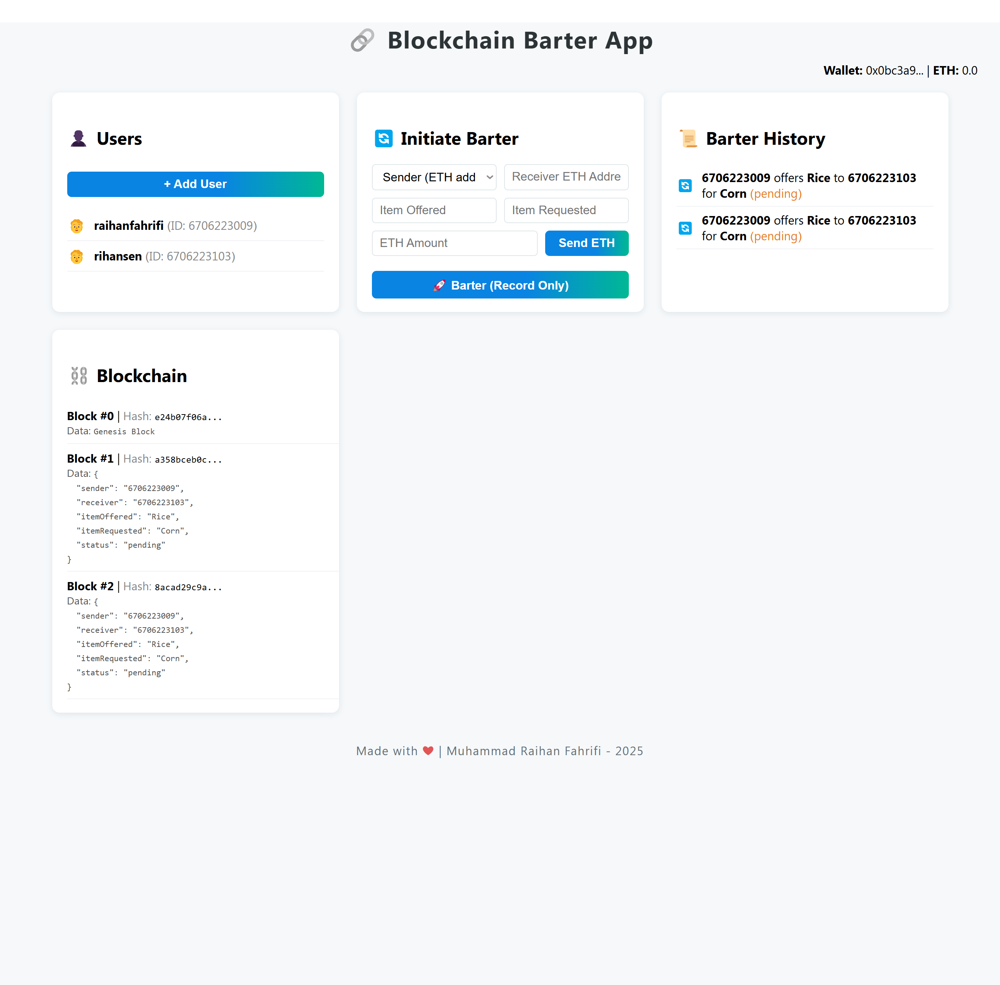

# Blockchain Barter App



## What is This App?

**Blockchain Barter App** is a simple web application that lets people trade (barter) items directly with each other. Every barter transaction is recorded on a blockchain, so all exchanges are transparent and cannot be changed. You can also send ETH (Ethereum) between users using MetaMask.  
This project is a basic prototype, but the idea is powerful: if money ever loses its value (due to inflation or other reasons), people can still exchange goods and services fairly—without relying on currency.

---

## Why is This Important?

- **No need for money:** You can trade items or services directly, without depending on cash or bank transfers.
- **Transparent and secure:** Every barter is recorded on a blockchain, so no one can cheat or change the history.
- **Future-proof:** If money ever becomes worthless, this kind of system could help people keep trading and surviving.

---

## Installation

### 1. Clone the Repository

```sh
git clone https://github.com/yourusername/blockchain-barter-app.git
cd blockchain-barter-app
```

### 2. Install Backend

```sh
cd backend
npm install
```

### 3. Install Frontend

```sh
cd ../frontend
npm install
```

---

## How to Run

### 1. Start the Backend

Open a terminal in the `backend` folder and run:

```sh
npx ts-node src/server.ts
```

The backend server will run on [http://localhost:3001](http://localhost:3001).

### 2. Start the Frontend

Open another terminal in the `frontend` folder and run:

```sh
npm start
```

The frontend will open in your browser at [http://localhost:3000](http://localhost:3000).

---

## How to Use

1. **Connect MetaMask**  
   - Click the "Connect MetaMask" button at the top right.
   - Approve the connection in your MetaMask extension.

2. **Add Users**  
   - Click "+ Add User" and enter a user ID and name.

3. **Initiate Barter**  
   - Fill in the barter form:
     - Select the sender (user).
     - Enter the receiver's ETH address.
     - Enter the item offered and requested.
     - (Optional) Enter the ETH amount if you want to send ETH.
   - Click "Send ETH" to send ETH via MetaMask.
   - Click "Barter (Record Only)" to record the barter transaction on the blockchain (no ETH sent).

4. **View History**  
   - See all barter transactions in the "Barter History" section.
   - See all blockchain blocks in the "Blockchain" section. Each block contains a barter transaction.

---

## Project Structure

```
blockchain-barter-app/
├── backend/
│   ├── src/
│   │   ├── app.ts
│   │   ├── server.ts
│   │   ├── barter/
│   │   ├── blockchain/
│   │   ├── types/
│   │   └── users/
│   ├── package.json
│   └── tsconfig.json
├── frontend/
│   ├── src/
│   ├── public/
│   ├── package.json
│   └── tsconfig.json
├── blockchain-barter-app-view.png
└── README.md
```

---

## Notes

- **MetaMask** is required for ETH transactions. Install it as a browser extension if you haven't already.
- This app is for learning/demo purposes and does not use a real public blockchain for barter records (only for ETH transfers).
- All data is stored in memory and will reset when the backend server restarts.
- This is a simple prototype, but the idea could become very important in the future, especially if money loses its value. Barter systems like this could help people keep trading and supporting each other.

---

## License

MIT License

---

**This is just the beginning. The future of trading could be moneyless, fair, and blockchain-powered!**
